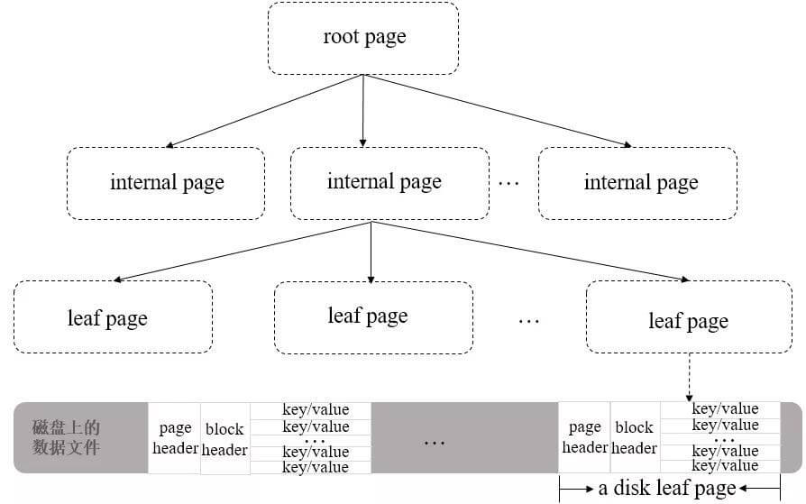
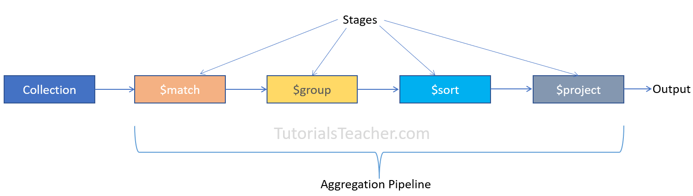
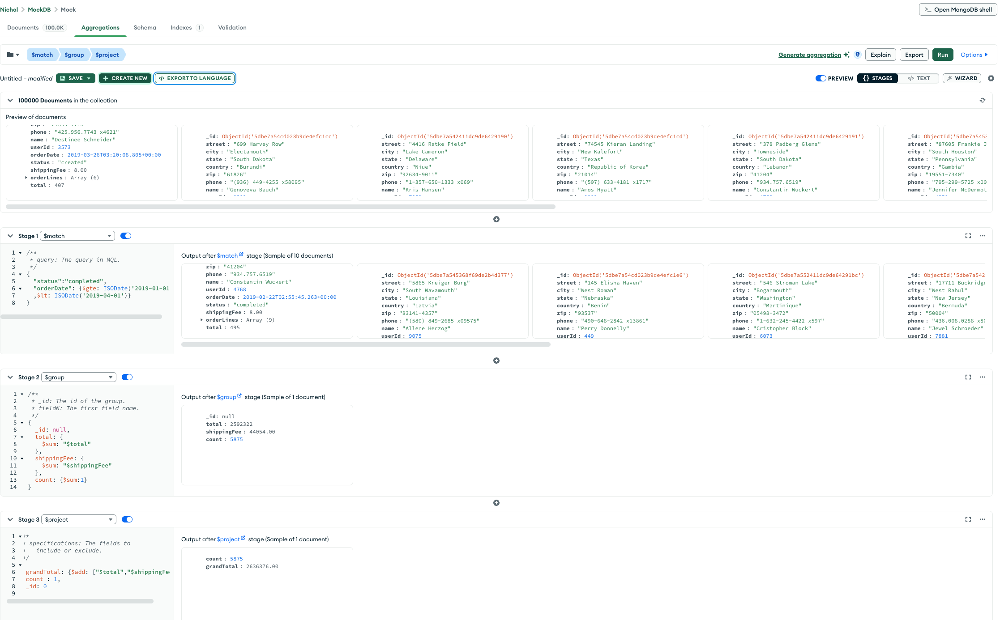

本文档跟随极客时间 MongoDB高手课
课件和Demo地址：
[https://gitee.com/geektime-geekbang/geektime-mongodb-course](https://gitee.com/geektime-geekbang/geektime-mongodb-course)

- [环境准备](#%E7%8E%AF%E5%A2%83%E5%87%86%E5%A4%87)
- [基础知识](#%E5%9F%BA%E7%A1%80%E7%9F%A5%E8%AF%86)
	- [为什么说MongoDB是无模式？](#%E4%B8%BA%E4%BB%80%E4%B9%88%E8%AF%B4MongoDB%E6%98%AF%E6%97%A0%E6%A8%A1%E5%BC%8F%EF%BC%9F)
	- [存储引擎](#%E5%AD%98%E5%82%A8%E5%BC%95%E6%93%8E)
	- [增删改查](#%E5%A2%9E%E5%88%A0%E6%94%B9%E6%9F%A5)
		- [Insert](#Insert)
		- [Find](#Find)
		- [Remove](#Remove)
		- [Update](#Update)
	- [MongoDB HelloWorld (Python)](#MongoDB%20HelloWorld%20(Python))
	- [MongoDB 聚合操作](#MongoDB%20%E8%81%9A%E5%90%88%E6%93%8D%E4%BD%9C)
	- [MongoDB的开发实践](#MongoDB%E7%9A%84%E5%BC%80%E5%8F%91%E5%AE%9E%E8%B7%B5)

## 环境准备

MongoDB官方提供了云端集群，可以免费使用小型集群来进行学习搭建。

**MongoDB Atlas(云端)+ MongoDB Compass(本地)+ MongoDB Command Line**

1. 云端创建账号，并建立一个free的cluster
2. Mongo官网下载 Compass，连接云端
3. 官网下载CL，执行命令将demo里的example docs上传到云端用来学习测试
 本地cmd跳转到CL包下的bin路径，执行：
``./mongorestore --uri=<your cluster url> --collection MockDB.Mock <your example demo floder> ``
## 基础知识
一个以JSON为数据模型的document database

|         | MongoDB                                   | RDBMS(关系型)  |
| ------- | ----------------------------------------- | ----------- |
| 数据模型    | 文档模型                                      | 关系模型        |
| 数据库类型   | OLTP                                      | OLTP        |
| CRUD 操作 | MQL/SQL                                   | SQL         |
| 高可用     | 复制集                                       | 集群模式        |
| 横向扩展能力  | 通过原生分片完善支持                                | 数据分区或者应用侵入式 |
| 索引支持    | B - 树、全文索引、地理位置索引、多键 (multikey) 索引、TTL 索引 | B 树         |
| 开发难度    | 容易                                        | 困难          |
| 数据容量    | 没有理论上限                                    | 千万、亿        |
| 扩展方式    | 垂直扩展 + 水平扩展                               | 垂直扩展        |
| 存储引擎    | B+树                                       |             |
### 为什么说MongoDB是无模式？

MongoDB的文档模型处于物理模型设计阶段，但与逻辑层类似，通过内嵌数组或引用字段表示关系，不遵从第三范式，允许冗余。

### 存储引擎
WiredTiger（B+树），以page为基本单位写入数据，共有以下三种page类型：
- **root page（根节点）**：B+ 树的根节点。
- **internal page（内部节点）**：不实际存储数据的中间索引节点。
- **leaf page（叶子节点）**：真正存储数据的叶子节点，包含一个页头（page header）、块头（block header）和真正的数据（key/value），其中页头定义了页的类型、页中实际载荷数据的大小、页中记录条数等信息；块头定义了此页的 checksum、块在磁盘上的寻址位置等信息。



### 增删改查
#### Insert
``` text
操作格式：

db.<集合>.insertOne(<JSON对象>)
db.<集合>.insertMany([<JSON 1>, <JSON 2>, …<JSON n>])

示例：
db.fruit.insertOne({name: "apple"})
db.fruit.insertMany([
{name: "apple"},
{name: "pear"},
{name: "orange"}
])
```


#### Find 
```text
find 示例：
db.movies.find( { "year" : 1975 } ) //单条件查询
db.movies.find( { "year" : 1989, "title" : "Batman" } ) //多条件 and查询
db.movies.find( { $and : [ {"title" : "Batman"}, { "category" : "action" }] } ) // and的另一种形式
db.movies.find( { $or: [{"year" : 1989}, {"title" : "Batman"}] } ) //多条件 or查询
db.movies.find( { "title" : /^B/} ) //按正则表达式查找
```

find 子查询：
```text
db.fruit.insertOne({
name: "apple",
from: {
country: "China",
province: "Guangdon"
}
})
正确查询方式：
db.fruit.find( { "from.country" : "China" } )
```

使用&elemMatch 来处理必须是同一个子对象满足多个子条件
```text
考虑以下两个查询：
db.getCollection('movies').find({
"filming_locations.city": "Rome",
"filming_locations.country": "USA"
}) // 可能返回多个对象
db.getCollection('movies').find({
"filming_locations": {
$elemMatch:{"city":"Rome", "country": "USA"}
}
}) // 必须是在一个对象都满足
```
find 的投影projection
```text
db.movies.find({"category": "action"},{"_id":0, title:1})
//不显示id只显示title
```

#### Remove
```text
db.testcol.remove ( { a : 1 } ) // 删除 a 等于 1 的记录

db.testcol.remove ( { a : { $ lt: 5 } } ) // 删除 a 小于 5 的记录

db.testcol.remove ( { } ) // 删除所有记录

db.testcol.remove () // 报错
```

#### Update
Update 操作执行格式：db.<集合>.update(<查询条件>, <更新字段>)
```text
db.fruit.insertMany([
{name: "apple"},
{name: "pear"},
{name: "orange"}
])
db.fruit.updateOne({name: "apple"}, {$set: {from: "China"}})
```

updateOne只更新一条，updateMany会更新多条
```text
* $set/$unset
• $push/$pushAll/$pop //对象到数组底部
• $pull/$pullAll  //如果匹配指定的值，从数组中删除相应的对象,如果匹配任意的值，从数据中删除相应的对象
• $addToSet //如果不存在则增加一个值到数组
```

### MongoDB HelloWorld (Python)
1. 安装MongoDB python驱动
``` shell
pyenv local 3.11.8 (own local python version)
pip install pymongo
pip show pymongo
```
2. 引入驱动
```python
import pymongo
pymongo.version

from pymongo import MongoClient
uri = ""mongodb+srv://<username>:<password>@clusterfortest.6nrk8nr.mongodb.net/?retryWrites=true&w=majority&appName=ClusterForTest" //got the uri from Mongo Altas
client = MongoClient(uri)
print client
```
3. 插入用户
```python
>>> db=client["eshop"]
>>> user_coll=db["users"]
>>> new_user={"username":"nina","password":"xxx","email":"123456@qq.com"}
>>> result = user_coll.insert_one(new_user)
>>> print(user_coll.find_one({"username":"nina"}))

{'_id': ObjectId('68a158eea7901775bba76452'), 'username': 'nina', 'password': 'xxx', 'email': '123456@qq.com'}
```
4. 更新用户
```python
>>> result=user_coll.update_one({"username":"nina"},{"$set":{"phone":"123456789"}})

>>> print(user_coll.find_one({"username":"nina"}))

{'_id': ObjectId('68a158eea7901775bba76452'), 'username': 'nina', 'password': 'xxx', 'email': '123456@qq.com', 'phone': '123456789'}

>>>
```

### MongoDB 聚合操作
聚合操作的基本格式：
```text
pipeline = [$stage1, $stage2, ...$stageN];
db.<COLLECTION>.aggregate(
pipeline,
{ options }
);
```


| 操作符                 | 功能描述                                | 基本语法示例                                                                                                         |
| ------------------- | ----------------------------------- | -------------------------------------------------------------------------------------------------------------- |
| **$match**          | 筛选文档，类似`find()`的查询条件，用于过滤数据         | `{ $match: { status: "active", age: { $gt: 18 } } }`                                                           |
| **$group**          | 按指定字段分组，结合累加器计算统计结果（如计数、求和）         | `{ $group: { _id: "$category", total: { $sum: 1 } } }`                                                         |
| **$project**        | 筛选或重命名字段，控制输出文档的结构（包含 / 排除字段、计算新字段） | `{ $project: { name: 1, price: 1, discounted: { $multiply: ["$price", 0.9] } } }`                              |
| **$sort**           | 对文档排序，1 为升序，-1 为降序                  | `{ $sort: { createdAt: -1, price: 1 } }`                                                                       |
| **$limit**          | 限制输出结果的数量                           | `{ $limit: 10 }`                                                                                               |
| **$skip**           | 跳过指定数量的文档（常用于分页）                    | `{ $skip: 20 }`                                                                                                |
| **$unwind**         | 将数组字段拆分为多个文档（每个元素对应一个文档）            | `{ $unwind: "$tags" }`                                                                                         |
| **$lookup**         | 类似 SQL 的 JOIN 操作，关联其他集合的数据          | `{ $lookup: { from: "orders", localField: "userId", foreignField: "user", as: "userOrders" } }`                |
| **$addFields**      | 为文档添加新字段（不会替换现有字段）                  | `{ $addFields: { fullName: { $concat: ["$firstName", " ", "$lastName"] } } }`                                  |
| **$out**            | 将聚合结果输出到指定集合（会覆盖现有集合）               | `{ $out: "aggregated_results" }`                                                                               |
| **$facet**          | 在同一输入上执行多个独立的聚合管道，适合同时获取多种统计结果      | `{ $facet: { total: [{ $count: "count" }], avgPrice: [{ $group: { _id: null, avg: { $avg: "$price" } } }] } }` |
| **$count**          | 统计文档数量（简化的`$group` + `$sum`）        | `{ $count: "totalUsers" }`                                                                                     |
| **$match + $group** | 先筛选再分组（常见组合）                        | `[{ $match: { status: "completed" } }, { $group: { _id: "$category", total: { $sum: "$amount" } } }]`          |
在demo数据库上的实操， 可以在MongoDB Compass上操作，还能直接转化为JAVA代码：
```text
查询2019年第一季度（1月1日~3月31日）已完成订单（completed）的订单总金
额和订单总数
db.orders.aggregate([
// 步骤1：匹配条件
{ $match: { status: "completed", orderDate: {
$gte: ISODate("2019-01-01"),
$lt: ISODate("2019-04-01") } } },
// 步骤二：聚合订单总金额、总运费、总数量
{ $group: {
_id: null,
total: { $sum: "$total" },
shippingFee: { $sum: "$shippingFee" },
count: { $sum: 1 } } },
{ $project: {
// 计算总金额
grandTotal: { $add: ["$total", "$shippingFee"] },
count: 1,
_id: 0 } }
])
// 结果：
// { "count" : 5875, "grandTotal" : NumberDecimal("2636376.00") }
```

Compass上转化为JAVA代码：
```java
Arrays.asList(new Document("$match", 
    new Document("status", "completed")
            .append("orderDate", 
    new Document("$gte", 
    new java.util.Date(1546300800000L))
                .append("$lt", 
    new java.util.Date(1554076800000L)))), 
    new Document("$group", 
    new Document("_id", 
    new BsonNull())
            .append("total", 
    new Document("$sum", "$total"))
            .append("shippingFee", 
    new Document("$sum", "$shippingFee"))
            .append("count", 
    new Document("$sum", 1L))), 
    new Document("$project", 
    new Document("grandTotal", 
    new Document("$add", Arrays.asList("$total", "$shippingFee")))
            .append("count", 1L)
            .append("_id", 0L)))
```

### MongoDB的开发实践

MongoDB的连接字符串可以配置大部分连接选项，建议总是在连接字符串中配置这些选项
* maxPoolSize: 连接池大小
* MaxWaitTime：查询的最大等待时间
* WriteConcern ：建议majority保证数据安全
* ReadConcern：对于数据一致性要求高的场景适当使用 

查询及索引：
* 每个查询都必须有对应的索引
* 尽量使用覆盖索引
* 使用projection来减少返回到客户端的文档内容

关于写入：
* 在update语句里只包括需要更新的字段
* 尽可能使用批量插入来提升写入的性能
* 使用TTL自动过期日志类型的数据

