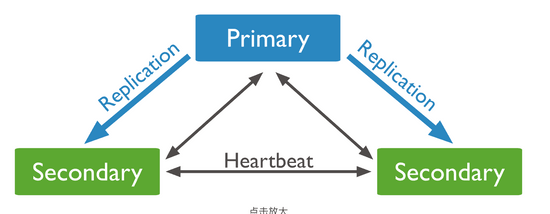
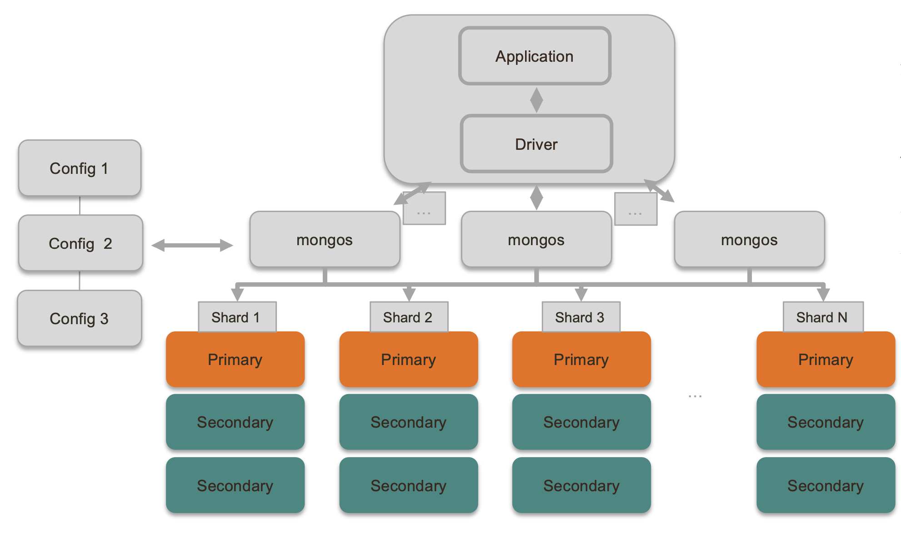

## 复制集群

通常来说，一个复制集群包含 1 个主节点（Primary），多个从节点（Secondary）以及零个或 1 个仲裁节点（Arbiter）。

- **主节点**：整个集群的写操作入口，接收所有的写操作，并将集合所有的变化记录到操作日志中，即 oplog。主节点挂掉之后会自动选出新的主节点。
- **从节点**：从主节点同步数据，在主节点挂掉之后选举新节点。不过，从节点可以配置成 0 优先级，阻止它在选举中成为主节点。
- **仲裁节点**：这个是为了节约资源或者多机房容灾用，只负责主节点选举时投票不存数据，保证能有节点获得多数赞成票。

主节点与备节点之间是通过 **oplog（操作日志）** 来同步数据的。oplog 是 local 库下的一个特殊的 **上限集合(Capped Collection)** ，用来保存写操作所产生的增量日志，类似于 MySQL 中 的 Binlog。

> 上限集合类似于定长的循环队列，数据顺序追加到集合的尾部，当集合空间达到上限时，它会覆盖集合中最旧的文档。上限集合的数据将会被顺序写入到磁盘的固定空间内，所以，I/O 速度非常快，如果不建立索引，性能更好。

## 分片集群

* Config servers: 配置服务器，本质上也是一个复制集，负责存储配置信息
* Mongos：路由服务，不存具体数据，从Config获取集群配置将请求转发到特定的分片，并整合分片结果返回客户端。
* Shard：每个分片都需要配置成副本集

### 分片策略
* 范围分片： 可以快速定位请求数据/但容易造成热点读写的问题/适合分片键值不是单调增减的，需要范围查询的
* Hash分片：具备分散性/不适合范围查询/