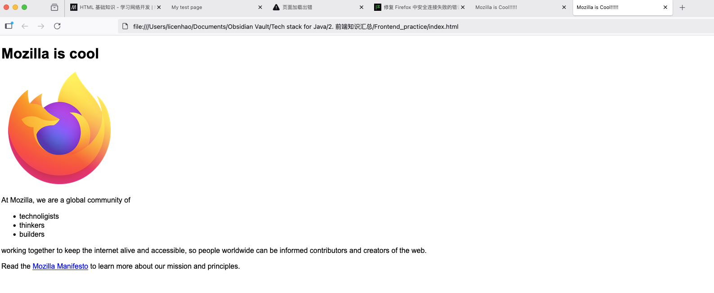
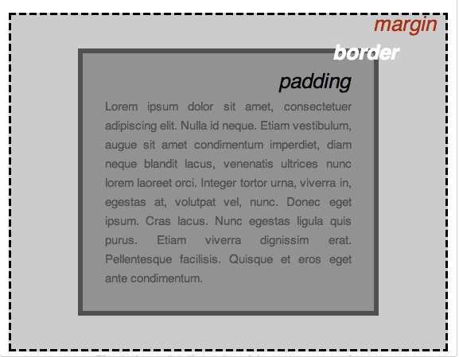
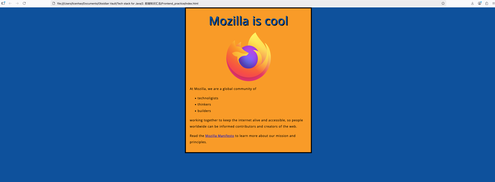
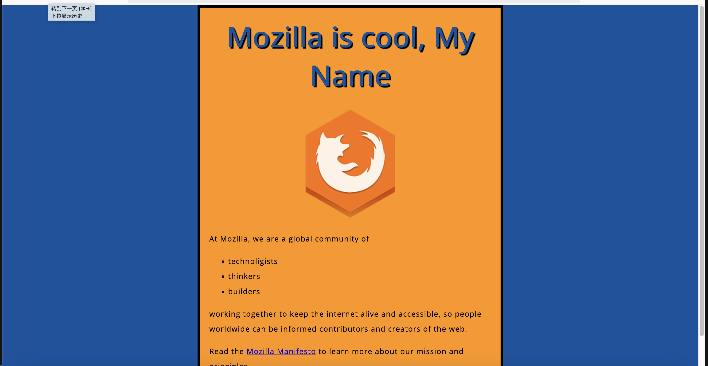

参考教程: [参考教程](https://web.nodejs.cn/en-us/docs/learn/getting_started_with_the_web/css_basics/)
## HTML
[HTML 基础语法](http://developer.mozilla.org/zh-CN/docs/Learn_web_development/Core/Structuring_content/Basic_HTML_syntax)

```html
<!DOCTYPE html>
<html lang="zh-CN">
<head>
    <meta charset="UTF-8">
    <!-- 定义视口元素以视口宽度呈现 -->
    <meta name="viewport" content="width=device-width, initial-scale=1.0"> 
    <!-- 会展示在tab页的标题 -->
    <title>Mozilla is Cool!!!!!</title>
</head>
<body>
    <!-- 页面内展示的标题 -->
    <h1>Mozilla is cool</h1>
    <!-- 图片展示，展示失败会显示alt的内容 -->
    
    <!-- 段落 -->
    <p>At Mozilla, we are a global community of</p>
    <!-- 数组，li表示无序列，ol表示有序列 -->
    <ul>
        <li>technoligists</li>
        <li>thinkers</li>
        <li>builders</li>
    </ul>
    <p>working together to keep the internet alive and accessible, so people worldwide can be informed contributors and creators of the web.</p>

    <p>
        Read the
        <!-- 超文本链接，后面是展示的链接名称 -->
        <a href="https://www.mozilla.org">Mozilla Manifesto</a>
        to learn more about our mission and principles.
    </p>
    
</body>
</html>
```

* `<span>` 没有任何语义，仅仅是包裹内容，行内容器
* `<div>` 块级无语义元素，可用于组合元素，划分区域。
* `<a href="url">文本</a>`：超链接
* ``
* `<link rel="stylesheet" href="样式文件.css">`：引入外部 CSS
* `<script src="脚本文件.js"></script>`：引入外部 JavaScript
* `<form action="/接口地址" method="POST">`：表单容器, action表示后端接口，method 请求
* `<input>`：输入控件
* `<textarea>`：多行文本输入
* `<select><option>选项1</option></select>`：下拉选择框
* `<label for="控件ID">文本</label>`：关联输入控件

## CSS

### 盒子模型

```plaintext
┌─────────────────────────────────────┐
│             margin（外边距）         │  盒子与其他元素的距离（透明，看不见）
│  ┌─────────────────────────────┐    │
│  │         border（边框）       │    │  盒子的“边框”（可见，可设置颜色/粗细）
│  │  ┌─────────────────────┐    │    │
│  │  │      padding（内边距） │    │    │  内容与边框的距离（透明，看不见）
│  │  │  ┌─────────────┐    │    │    │
│  │  │  │   content   │    │    │    │  盒子里的内容（文字、图片等）
│  │  │  └─────────────┘    │    │    │
│  │  └─────────────────────┘    │    │
│  └─────────────────────────────┘    │
└─────────────────────────────────────┘
```

- **content**：盒子里的物品（比如手机）, 元素的实际内容，通过Width、Height 设置
- **padding**：物品周围的泡沫（保护物品，让物品不贴紧盒子边缘），内容区与边框的距离，如`padding：10px`
- **border**：快递盒的硬纸板外壳（可见的边框）, 如`border: 1px solid #ccc;`（1px 宽、实线、灰色）
- **margin**：快递盒与其他快递盒之间的空隙（避免挤在一起）, 盒子与其他元素的距离，如`margin: 20px 0;`（上下 20px，左右 0）
### 样式  
* 行内样式：直接写在HTML标签中
  ````html
<div style="color: red; font-size: 16px;">红色文本</div>
````
* 内部样式：写在 HTML 的`<head><style></style></head>`中，作用于当前页面。
* 外部样式：单独的`.css`文件，通过`<link rel="stylesheet" href="样式.css">`引入
  
### 选择器：
* 标签选择器：`p { color: gray; }  /* 所有<p>标签文本变灰色 */`
* 类选择器：`.warning { color: red; }  /* 所有class="warning"的元素变红 */`
* 后代选择器： `.nav a { text-decoration: none; }  /* 选中class="nav"内的所有<a>标签，去除下划线 */`
* ID选择器：`#user-info { border: 1px solid black; }  /* 仅id="user-info"的元素加边框 */`
*  后代选择器：`.nav a { text-decoration: none; }  /* 选中class="nav"内的所有<a>标签，去除下划线 */`
**优先级**：行内样式（style属性）> ID 选择器> 类选择器 > 标签选择器
### 布局与定位
* display: 控制元素的显示方式

| 显示方式         | 特征                  | 样例           |
| ------------ | ------------------- | ------------ |
| block        | 块级元素，独占一行，可设置宽高     | `<div> <p>`  |
| inline       | 行内元素，不独占一行，不可设置宽高   | `<span> <a>` |
| inline-block | 兼具行内和块级特性           | 按钮           |
| flex         | 弹性布局，现代布局首选，快速水平/居中 |              |
* position: 控制元素的定位方式

| 定位方式     | 特征              |     |
| -------- | --------------- | --- |
| relative | 相对定位，相对于自身原位置偏移 |     |
| absolute | 绝对定位，           |     |
| fixed    | 固定定位，相对于浏览器窗口定位 |     |

### Demo


在demo里添加了 css的链接：
```html
<head>
    <meta charset="UTF-8">
    <!-- 定义视口元素以视口宽度呈现 -->
    <meta name="viewport" content="width=device-width, initial-scale=1.0">
    <!-- 会展示在tab页的标题 -->
    <title>Mozilla is Cool!!!!!</title>
    <!-- 连接了css渲染html -->
    <link href="style.css" rel="stylesheet" />
    <!-- 连接了字体 -->
    <link href="https://fonts.googleapis.com/css?family=Open+Sans" rel="stylesheet" />

</head>
```

```css
/* 对整个整个html标签设置样式（影响整个页面的基础样式） */
html {
    font-size: 16px; /* 设定页面基础字体大小为16像素（px是像素单位） */
    font-family: "Open Sans", sans-serif; /* 设定页面默认字体：优先使用"Open Sans"字体，如果没有则使用系统默认无衬线字体（sans-serif） */
  }

/* 对h1标题标签设置样式 */
h1 {
    font-size: 60px; /* h1标题的字体大小为60像素（比基础字体大） */
    text-align: center; /* 文字居中对齐 */
  }

/* 同时对p标签（段落）和li标签（列表项）设置相同样式 */
p,
li {
    font-size: 16px; /* 字体大小为16像素（和基础字体一致） */
    line-height: 2; /* 行高为字体大小的2倍（让行与行之间更宽松，易读） */
    letter-spacing: 1px; /* 字母/文字之间的间距为1像素（增加可读性） */
  }

/* 再次对html标签设置样式（可以多次设置，后面的样式会覆盖前面重复的属性） */
html {
    background-color: #00539f; /* 页面最外层背景色为深蓝色（#00539f是十六进制颜色码） */
  }

/* 对body标签设置样式（body是页面内容的容器） */
body {
    width: 600px; /* 内容区宽度固定为600像素 */
    margin: 0 auto; /* 上下外边距为0，左右自动居中（让内容区在页面中间显示） */
    background-color: #ff9500; /* 内容区背景色为橙色（覆盖了外层html的蓝色） */
    padding: 0 20px 20px 20px; /* 内边距：上0、右20px、下20px、左20px（内容与边框的距离） */
    border: 5px solid black; /* 边框：5像素宽、实线、黑色 */
  }

/* 再次对h1标签设置样式（补充前面的设置） */
h1 {
    margin: 0; /* 清除默认的外边距 */
    padding: 20px 0; /* 上下内边距20px，左右0（让标题与上下内容拉开距离） */
    color: #00539f; /* 标题文字颜色为深蓝色（和html背景色呼应） */
    text-shadow: 3px 3px 1px black; /* 文字阴影：水平偏移3px、垂直偏移3px、模糊1px、黑色阴影 */
  }

/* 对img标签（图片）设置样式 */
img {
    display: block; /* 把图片从"行内元素"转为"块级元素"（块级元素才能设置自动居中） */
    margin: 0 auto; /* 图片在父容器中水平居中 */
  }
```


## JavaScript
新增效果：
1. 图片切换，点击原来的firefox图标可以切换到当前图标，再次点击还可以切回去。
2. 首次进入页面显示‘pls input your name：’ 对话框，可以定制名字在h1上


index.html body部分添加：
```html
<button>Change user</button>
<script src="scripts/main.js"></script>
```

项目路径下新建/scripts/main.js
新增javaScript代码：
```javaScript
const myImage = document.querySelector("img"); //选取元素

//图片切换
myImage.onclick = () => { //点击事件，箭头匿名函数
    const mySrc = myImage.getAttribute("src");
    if (mySrc === "images/firefox-icon.png") {
        myImage.setAttribute("src", "images/firefox2.png");
    } else {
        myImage.setAttribute("src", "images/firefox-icon.png");
    }
};

let myButton = document.querySelector("button");
let myHeading = document.querySelector("h1");
function setUserName() {
    const myName = prompt("Please enter your name.");//弹出输入框，返回输入值
    if (!myName) {
        setUserName();
    } else {
        localStorage.setItem("name", myName); //本地存储, 存储键值对，即使重启浏览器也依然存在
        myHeading.textContent = `Mozilla is cool, ${myName}`;
    }
}

if (!localStorage.getItem("name")) {
    setUserName();
} else {
    const storedName = localStorage.getItem("name");
    myHeading.textContent = `Mozilla is cool, ${storedName}`;
}

myButton.onclick = () => {
    setUserName();
}   
```
